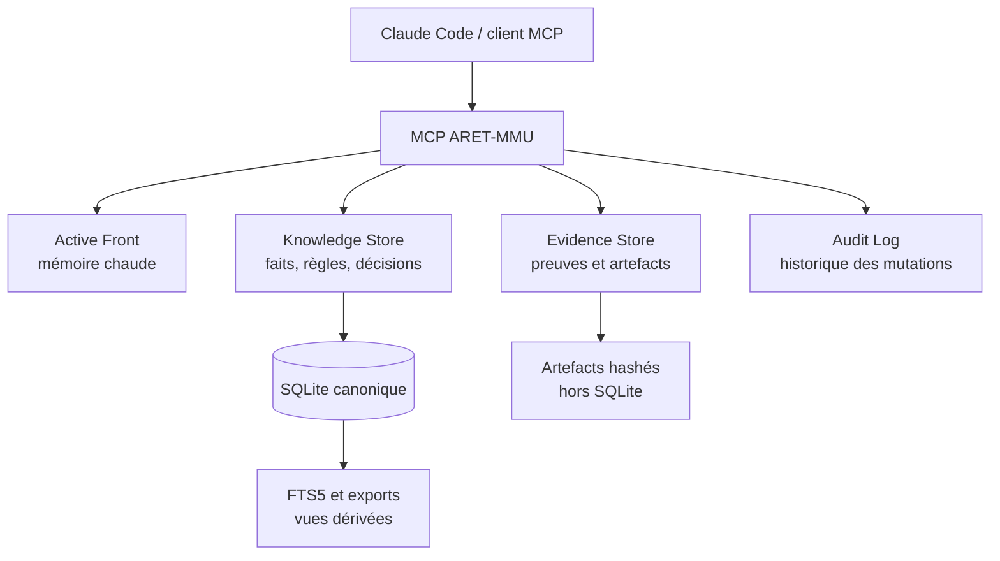

# Guide vulgarisé du fonctionnement du MCP ARET-MMU

**Public visé :** responsable du projet ARET, développeur, vérificateur technique et utilisateur de Claude Code.
**But :** expliquer de manière simple, mais complète, ce que fait le MCP ARET-MMU, pourquoi il existe et comment il travaille au quotidien.

> **L’idée en une phrase :** ARET-MMU est la mémoire durable, structurée et vérifiable d’ARET. Claude peut la consulter et l’enrichir, mais ne peut pas la réécrire librement ni déclarer qu’une chose est prouvée sans trace d’exécution contrôlée.

---

## 1. Le problème que le MCP résout

ARET est un projet technique long et complexe. Sans mémoire externe fiable, chaque nouvelle session de Claude doit relire de gros documents historiques, retrouver ce qui était en cours, distinguer les faits prouvés des hypothèses et reconstruire le contexte de travail. Cela coûte beaucoup de contexte et reste fragile : une compression de conversation, un changement de machine ou une perte de session peut faire disparaître la mémoire de travail du modèle.

ARET-MMU remplace cette dépendance à la conversation par un **Memory Store** local. La conversation devient temporaire ; la mémoire du projet reste dans une base SQLite. Claude peut disparaître, être remplacé, redémarrer ou compacter son contexte : les connaissances, les preuves, les liens et le Front de travail restent disponibles.

| Sans ARET-MMU | Avec ARET-MMU |
|---|---|
| La mémoire vit surtout dans la conversation et des Markdown volumineux. | La mémoire vit dans une base SQLite structurée. |
| Une recherche peut facilement être confondue avec une réponse fiable. | La recherche découvre ; la lecture adressée récupère le fait exact. |
| Une phrase de Claude peut sembler prouvée sans l’être. | `PROVEN` exige une preuve d’exécution `PASS` admissible. |
| Reprendre un travail exige de relire beaucoup d’historique. | Le Front fournit un contexte court, puis les pages froides sont lues à la demande. |
| La mémoire dépend du modèle ou de la machine. | Elle se transporte par Git ou par bundle vérifié. |

---

## 2. Les cinq couches du système

On peut imaginer ARET-MMU comme une petite bibliothèque technique avec cinq espaces distincts.



| Couche | Analogie simple | Rôle réel |
|---|---|---|
| **Knowledge Store** | La bibliothèque technique. | Connaissances durables : règles, architecture, forensics, mesures, hypothèses, décisions et états. |
| **Active Front** | Le bureau ouvert devant vous. | Contexte très court : sous-système, brique, mur actuel, prochaine action et adresses prioritaires. |
| **Evidence Store** | Le classeur de pièces justificatives. | Résultats d’oracles, commandes, horaires, environnement et artefacts hashés. |
| **Audit Log** | Le registre des opérations. | Qui a créé ou modifié quoi, quand, et ce qui existait avant/après. |
| **Index FTS5 / exports** | Le catalogue et les photocopies. | Recherche rapide et vues humaines, toujours reconstructibles depuis SQLite. |

La règle fondamentale est la suivante : **SQLite est la source canonique**. Un export HTML, un bundle, un index de recherche ou une réponse de hook peut être supprimé et reconstruit. Une connaissance canonique dans SQLite ne dépend pas d’un résumé LLM. [1]

---

## 3. Ce que contient la mémoire

### 3.1 Les connaissances

Une connaissance est une fiche durable. Elle possède un identifiant stable, un titre, un contenu, un type, un statut, des tags, des liens éventuels vers un composant, une fonction, une brique, une source documentaire et des preuves.

| Type | Signification simple | Exemple dans ARET |
|---|---|---|
| `RULE` | Règle non négociable. | Un appel indirect non résolu doit s’arrêter bruyamment. |
| `ARCHITECTURE` | Décision de structure du système. | Modèle shared-stack ou stratégie de lifting. |
| `DECISION` | Choix effectué avec justification. | Choisir un driver déterministe plutôt qu’un test flou. |
| `FORENSIC` | Analyse d’un bug ou d’un incident. | Cause racine d’une dérive `ESP`. |
| `OBSERVATION` | Fait vu mais pas encore expliqué. | Une trace montre un comportement précis. |
| `HYPOTHESIS` | Piste de travail explicitement non prouvée. | Un thunk pourrait être responsable. |
| `STATE` | État d’un sous-système. | État d’avancement d’un chantier EH. |
| `MEASUREMENT` | Mesure brute ou agrégée. | Nombre de fonctions testées ou de divergences. |
| `DISCOVERY` | Découverte issue d’une exploration. | Import ou symbole récurrent identifié. |

Une fiche est accessible par une adresse stable, par exemple :

```text
ARET://knowledge/EH-0025
```

Cette adresse est indépendante des anciens fichiers Markdown. Les documents 70, 71, 80, 81, 82 et 90 servent de **sources de migration**, pas d’API opérationnelle principale.

### 3.2 Les composants, fonctions et briques

Les connaissances peuvent être organisées autour de trois objets complémentaires.

| Objet | Question à laquelle il répond | Exemple |
|---|---|---|
| **Component** | Dans quel sous-système sommes-nous ? | `EH`, `HLE`, `X87`, `LIFT`, `ABI`. |
| **Function** | Quel symbole ou quelle fonction est concerné ? | `EH:msvcrt!__except_handler3`. |
| **Brick** | Quel chantier concret est suivi ? | `AUTO-LIFT-02`, `M7-GUI`, `FIBERS-01`. |

Le Store livré contient notamment neuf fonctions adressables et dix briques d’ingénierie. Le Front pointe sur la brique `AUTO-LIFT-02` afin que la prochaine session commence sur l’objectif de lifting de DLL applicatives, et non sur la migration du MCP lui-même. [2]

---

## 4. La différence essentielle entre rechercher et lire

C’est le mécanisme le plus important à comprendre.

> **Chercher n’est pas savoir. Lire exactement est savoir ce qui est stocké.**

### 4.1 `aret_find` : trouver des candidats

`aret_find` sert à rechercher des fiches avec des critères : composant, fonction, tag, type, statut, date ou texte. Il utilise l’index FTS5 pour être rapide, mais ne renvoie volontairement pas le contenu complet d’une connaissance.

Par exemple, Claude peut demander : « quelles analyses concernent `callee-pop` dans `ABI` ? ». Le MCP peut retourner des adresses comme `ARET://knowledge/ABI-0006`, un titre, des tags et éventuellement un score de recherche.

Ce résultat ne signifie pas que la fiche démontre quoi que ce soit. Il dit seulement : **voici des candidats que vous pouvez lire**.

### 4.2 `aret_read` : lire un objet précis

Après avoir choisi une adresse, Claude appelle `aret_read`. Le MCP retourne alors le contenu exact stocké, le hash du contenu, le type, le statut, la provenance documentaire, les tags et les liens utiles.

### 4.3 `aret_read_batch` : lire plusieurs pages sans inonder le contexte

Lorsque plusieurs fiches sont nécessaires, `aret_read_batch` les lit dans une même opération. Il impose deux bornes : un nombre maximal d’objets et un volume maximal d’octets. Si une demande dépasse ces bornes, le MCP refuse explicitement au lieu de retourner une réponse coupée ou trop volumineuse.

| Action | Ce que le MCP renvoie | Ce qu’elle ne fait pas |
|---|---|---|
| `aret_find` | Adresses, titres, métadonnées, score éventuel. | Ne livre pas le contenu intégral et ne prouve rien. |
| `aret_read` | Une fiche exacte et complète. | Ne cherche pas par approximation. |
| `aret_read_batch` | Plusieurs fiches explicitement demandées, sous bornes. | Ne sélectionne pas les fiches à la place de Claude. |

Cette séparation évite le comportement dangereux « j’ai trouvé quelque chose de ressemblant, donc j’en déduis que c’est vrai ».

---

## 5. Les statuts : ce qui est certain et ce qui ne l’est pas

Chaque connaissance a un **statut**. Le statut ne décrit pas le contenu ; il décrit le niveau de confiance autorisé par le système.

| Statut | Traduction simple | Utilisation correcte |
|---|---|---|
| `ACTIVE` | Pertinent actuellement. | Règle ou état toujours utile. |
| `OBSERVED` | Vu ou mesuré, sans preuve causale complète. | Résultat prudent par défaut des migrations historiques. |
| `HYPOTHESIS` | Piste de travail. | À investiguer, jamais à présenter comme un fait. |
| `PROVEN` | Confirmé par une preuve d’exécution admissible. | Peut soutenir une conclusion technique. |
| `SUPERSEDED` | Remplacé par une version plus récente. | Reste lisible pour comprendre l’historique. |
| `OBSOLETE` | N’est plus applicable. | Conservé mais non actif. |
| `CONFLICTING` | En conflit explicite. | Doit empêcher une conclusion silencieuse. |

Le statut le plus sensible est `PROVEN`. Claude ne peut pas l’obtenir en écrivant simplement `status="PROVEN"`. Deux protections s’appliquent :

1. le code du serveur vérifie qu’il existe au moins une preuve liée, `PASS` et admissible ;
2. les triggers SQLite rejettent également une insertion ou une promotion non justifiée.

Ainsi, même une erreur dans la façade MCP ne permet pas de contourner facilement la règle au niveau de la base. [3]

---

## 6. Les preuves : pourquoi un test ne devient pas automatiquement une vérité

Une preuve est séparée d’une connaissance. C’est volontaire : une phrase comme « le test est vert » n’est pas une preuve suffisante. Une preuve contient le contexte d’exécution qui permet de vérifier ce résultat.

| Élément d’une preuve | Pourquoi il est conservé |
|---|---|
| Type d’oracle | Savoir quel test a été exécuté. |
| Commande effective | Pouvoir rejouer ou auditer le test. |
| Résultat et code de sortie | Distinguer PASS, FAIL, ERROR, SKIPPED et UNKNOWN. |
| Horaires | Situer l’exécution dans le temps. |
| Environnement | Connaître les dépendances, la révision et le contexte. |
| Artefact | Conserver stdout, stderr et détails complets hors SQLite. |
| SHA-256 | Détecter une modification ultérieure de l’artefact. |
| HMAC | Vérifier que le reçu a été produit avec la clé locale attendue. |

Les gros logs ne sont pas stockés dans SQLite. Ils sont enregistrés sous `.aret-memory/artifacts/`. SQLite ne conserve que leur chemin relatif, leur taille, leur hash et leurs métadonnées. Lors d’une lecture d’artefact, le MCP recalcule le hash : si le fichier a changé, la lecture est refusée.

### 6.1 Pourquoi la clé HMAC est utile

La clé `ARET_PROOF_HMAC_SECRET` sert à signer le reçu de preuve. Elle ne rend pas le test « vrai » par magie ; elle garantit qu’une preuve marquée admissible a été générée par un environnement qui connaissait le secret attendu.

Sans clé, un oracle peut encore être exécuté et enregistré, mais son résultat restera non admissible. Cela permet de conserver l’information sans permettre une promotion imprudente vers `PROVEN`.

### 6.2 Les résultats possibles

| Résultat | Signification |
|---|---|
| `PASS` | Le gate a réussi selon sa signature de succès. |
| `FAIL` | Une divergence ou un échec de test a été mesuré. |
| `ERROR` | Le test n’a pas donné de verdict valide ou a échoué techniquement. |
| `SKIPPED` | Une dépendance requise est absente ; aucun verdict de conformité n’est tiré. |
| `UNKNOWN` | Mesure enregistrée, mais non interprétée comme gate de conformité. |

`winehash` est volontairement `UNKNOWN`. Il produit des empreintes Wine utiles pour une comparaison avec un runner Windows, mais ne prétend pas à lui seul établir la conformité.

---

## 7. Les neuf oracles disponibles

Un oracle est un test d’ARET que le MCP peut lancer sans accepter de commande shell libre. Le client choisit un nom dans une liste fermée ; le serveur connaît à l’avance le script ou la commande autorisée.

| Oracle | Ce qu’il vérifie, en termes simples |
|---|---|
| `difftest` | Compare le comportement de fonctions décompilées/recompilées avec l’original. |
| `transpilediff` | Vérifie le pipeline de transpilation complet et son hash comportemental. |
| `stdcall_audit` | Vérifie les callee-pops `__stdcall`, donc les risques de dérive `ESP`. |
| `winediff` | Compare des programmes ARET au comportement Wine. |
| `winehash` | Capture des empreintes Wine à comparer à un environnement Windows. |
| `ehdiff` | Vérifie les cas d’exceptions MSVC/C++ et SEH. |
| `gnuehdiff` | Vérifie les exceptions GNU/Itanium C++. |
| `funcdiff` | Vérifie la conservation du comportement à travers le lifting et l’optimisation. |
| `cpudiff` | Compare des instructions et séquences CPU avec Unicorn. |

Si une dépendance manque — Wine, MinGW, Clang, Cargo, le binaire ARET ou le corpus — le MCP enregistre `SKIPPED`. Il ne transforme jamais une impossibilité d’exécution en `PASS`.

---

## 8. Le graphe de relations : relier les fiches entre elles

Une base de fiches isolées serait peu pratique. ARET-MMU maintient donc des relations explicites entre objets.

| Relation | Lecture simple |
|---|---|
| `CONCERNS` | Cette fiche concerne cette fonction ou entité. |
| `VERIFIED_BY` | Cette connaissance est justifiée par cette preuve. |
| `SUPERSEDES` | Cette nouvelle fiche remplace une ancienne fiche. |
| `INFORMED_BY` | Cette décision s’appuie sur cette information. |
| `BLOCKED_BY` | Cette brique est bloquée par cette cause. |
| `IMPLEMENTS` | Cette entité met en œuvre une autre entité ou règle. |
| `DERIVED_FROM` | Cette connaissance dérive d’une source ou d’une autre connaissance. |
| `APPLIES_TO` | Cette règle s’applique à cette cible. |
| `CAUSED_BY` | Cette conséquence est causée par cette source. |
| `EVOLVES_TO` | Cette observation ou état évolue vers un autre. |

Le Store livré contient 35 relations, dont des liens `CONCERNS` entre analyses forensiques et fonctions importantes, et une relation `SUPERSEDES` explicitement documentée entre deux correctifs ABI.

### 8.1 Pourquoi les relations ont aussi un cycle de vie

Une relation peut devenir obsolète. Au lieu de l’effacer, `aret_supersede_relation` crée une nouvelle relation active, marque l’ancienne `SUPERSEDED`, indique son remplacement et inscrit l’opération dans l’audit.

`aret_get_related` retourne les relations actives par défaut. Si vous voulez comprendre l’historique, vous demandez explicitement `include_inactive=true`. Cette logique évite que Claude raisonne sur un lien ancien sans le savoir, tout en conservant la traçabilité complète.

---

## 9. Le Front : ce que Claude reçoit au démarrage

Le Front est volontairement petit. Ce n’est pas un résumé de tout ARET. C’est un panneau indiquant : « où dois-je travailler maintenant ? ».

Le Front actuel indique notamment :

| Champ | Valeur actuelle |
|---|---|
| Sous-système | DLL tierces C++ / Lifting |
| Brique | `AUTO-LIFT-02` |
| Mur courant | Lifting de DLL applicatives et récupération d’appels indirects |
| Prochaine action | Sélection pré-lift et driver déterministe sur une première bibliothèque applicative |
| Pages pertinentes | Cinq adresses de règles, mesures et corrections utiles |

Le Front peut être mis à jour partiellement avec `aret_update_front`, remplacé proprement avec `aret_replace_front` ou complété avec `aret_rebuild_front`. Son contenu est audité. Si le Front est perdu ou mauvais, les connaissances profondes restent intactes ; on le reconstruit à partir de SQLite. La clé `brick` est contrôlée : elle ne peut référencer qu’une brique `ACTIVE`, jamais une brique uniquement planifiée.

---

## 10. Les 32 outils MCP, regroupés simplement

Le MCP expose 32 outils. Il n’est pas nécessaire de les mémoriser un par un ; ils se répartissent en familles.

### 10.1 Démarrer, restaurer et se repérer

| Outil | Usage |
|---|---|
| `aret_boot` | Donne la doctrine, les versions, les chemins et le mode écriture. |
| `aret_restore` | Prépare un contexte de reprise court. |
| `aret_get_front` | Lit le bureau de travail actuel. |

### 10.2 Chercher et lire

| Outil | Usage |
|---|---|
| `aret_find` | Cherche des candidats. |
| `aret_read` | Lit une adresse exacte. |
| `aret_read_batch` | Lit plusieurs adresses exactes avec des bornes. |
| `aret_get_forensics` | Cherche les forensics d’un composant ou d’une fonction. |
| `aret_get_proofs` | Liste les preuves reliées à une connaissance. |
| `aret_get_related` | Traverse le graphe de relations. |
| `aret_get_roadmap` | Retourne une roadmap compacte, filtrable par jalon, composant ou plateforme. |
| `aret_read_artifact` | Lit explicitement un log ou un artefact hashé. |

### 10.3 Écrire de manière contrôlée

| Outil | Usage |
|---|---|
| `aret_append_knowledge` | Ajoute une nouvelle connaissance. |
| `aret_update_front` | Modifie quelques clés du Front. |
| `aret_replace_front` | Remplace le Front entier avec audit. |
| `aret_rebuild_front` | Ajoute des pointeurs Front dérivés. |
| `aret_register_component` | Crée un sous-système. |
| `aret_register_function` | Crée un symbole/fonction. |
| `aret_register_brick` | Crée une brique avec état, jalon, plateforme et priorité. |
| `aret_update_brick` | Fait évoluer de façon auditée l’état et le classement d’une brique. |
| `aret_add_relation` | Ajoute un lien typé. |
| `aret_supersede_relation` | Remplace un lien sans effacer l’ancien. |
| `aret_rebuild_index` | Reconstruit l’index FTS5. |

### 10.4 Produire et gérer les preuves

| Outil | Usage |
|---|---|
| `aret_run_oracle` | Lance l’un des neuf oracles fermés. |
| `aret_record_proof` | Enregistre une preuve déjà produite. |
| `aret_attach_proof` | Lie une preuve à une connaissance et demande éventuellement une promotion. |
| `aret_invalidate_proof` | Rend une preuve non admissible et réévalue les connaissances `PROVEN`. |

### 10.5 Transporter et exporter la mémoire

| Outil | Usage |
|---|---|
| `aret_export` | Produit JSON, Markdown, HTML ou bundle. |
| `aret_export_reference_91` | Produit la vue consolidée 91 depuis SQLite. |
| `aret_export_roadmap` | Produit une roadmap Markdown dérivée, hashée et filtrable. |
| `aret_export_bundle` | Produit un Memory Bundle v3 vérifié. |
| `aret_import_bundle` | Importe un bundle dans un Store vide et validé. |
| `aret_sync_memory` | Applique la politique Git locale bornée à la mémoire. |

### 10.6 La vue roadmap V1.1

Chaque brique dispose désormais d’un `milestone`, d’une `target_platform` et d’une `priority` de 1 à 5. `aret_get_roadmap` assemble, sous une borne d’items, les briques non terminées avec leurs bloqueurs, leurs relations d’implémentation, leurs sources de décision et leurs preuves directes. `aret_export_roadmap` produit une vue Markdown hashée, dérivée de SQLite.

Une protection complémentaire est appliquée : une brique `ACTIVE` affichée dans le Front ne peut pas être passée à un autre état sans remplacer d’abord le Front. Cette règle empêche de déclarer un chantier terminé alors que la session en cours le présente encore comme travail actif.

Tous les outils retournent des réponses structurées. En cas d’erreur métier — adresse invalide, objet absent, écriture interdite, preuve insuffisante, dépassement de borne — le MCP renvoie une erreur explicite. Il ne tente pas de deviner une réponse.

---

## 11. Mode lecture seule et mode écriture

Par défaut, le MCP est en lecture seule. Cela signifie que Claude peut explorer tout le Store, mais ne peut pas créer une connaissance, modifier le Front, enregistrer une preuve ou lancer une mutation durable.

Pour autoriser les écritures, l’environnement doit contenir :

```bash
export ARET_WRITE_ENABLED=true
```

Le mode lecture seule est utile pour une revue, un audit ou un premier essai. Le mode écriture est approprié pour le travail quotidien après validation de l’environnement.

Même en écriture, Claude n’a pas de droit illimité : les mutations sont validées, encadrées, transactionnelles et auditées. Il n’existe pas d’outil MCP « exécuter du SQL » ou « supprimer une fiche quelconque ».

---

## 12. Git : sauvegarder la mémoire sans committer le code par erreur

Le MCP sait synchroniser **uniquement** le Memory Store, jamais le code source ARET.

Le répertoire mémoire réel se trouve sous :

```text
aret-memory/.aret-memory/
```

La couche Git calcule la racine du dépôt, puis vérifie que tous les changements concernés restent sous ce seul sous-arbre. Si un fichier hors mémoire a changé — par exemple un `.rs`, un `.py` ou un Markdown du projet — le commit mémoire automatique est refusé.

| Réglage | Valeur livrée | Effet |
|---|---:|---|
| `auto_commit` | `false` | Aucun commit automatique par défaut. |
| `auto_push` | `false` | Aucun push automatique par défaut. |
| `remote` | `origin` | Dépôt distant prévu si le push est activé plus tard. |
| `branch` | vide | Une branche explicite est requise pour auto-push. |

Quand l’auto-sync est activée, elle intervient **après** le commit SQLite. Si Git échoue, la mémoire SQLite reste valide : l’échec est signalé dans l’état de synchronisation, mais la transaction mémoire n’est jamais annulée.

Avant un export de bundle ou un commit Git mémoire, ARET-MMU force un checkpoint WAL. Cela évite de versionner ou de copier une base dont les dernières modifications resteraient seulement dans le journal SQLite `-wal`.

---

## 13. Bundles : transporter la mémoire sur une autre machine

Un **Memory Bundle v3** est une archive ZIP vérifiée. Il sert lorsque Git n’est pas disponible, pour une sauvegarde d’urgence ou pour une migration.

```text
bundle.zip
├── manifest.json       # Version, hashes, source, inventaires
├── snapshot.json       # Etat logique canonique de la mémoire
├── artifacts/          # Logs et preuves hashés
└── schema/             # Migrations SQL et leurs hashes
```

Le bundle n’est pas une simple copie de fichier. Son import contrôle le manifest, le hash logique, le hash du snapshot, les migrations et les artefacts. Un bundle modifié ou tronqué est refusé.

Pour éviter une fusion dangereuse de deux bases SQLite vivantes, le MCP n’importe un nouveau bundle que dans une cible vide. Réimporter exactement le même bundle est idempotent : le système reconnaît son hash et ne duplique pas les données.

---

## 14. Les hooks Claude Code : reprise automatique après une session ou une compaction

Les hooks évitent de dépendre de la mémoire du modèle. Ils sont installés dans `.claude/settings.json` et lancent des scripts ARET-MMU au bon moment.

| Moment | Hook | Ce qu’il fait |
|---|---|---|
| Début de session | `SessionStart` | Appelle la restauration et injecte doctrine + Front + adresses utiles dans `additionalContext`. |
| Avant compaction | `PreCompact` | Prépare un checkpoint léger et des adresses de reprise ; écriture seulement si activée explicitement. |
| Après compaction | `PostCompact` | Trace le résultat de compaction et fournit un contexte de reprise minimal. |

La quantité de contexte injectée est plafonnée. Le hook ne recharge ni le journal complet ni tout un sous-système. Claude démarre avec le Front, puis appelle FIND et READ selon la tâche.

> Le mécanisme important n’est pas « Claude doit se souvenir d’appeler le MCP ». Le runtime Claude Code déclenche la restauration à sa place.

---

## 15. Une journée de travail typique avec ARET-MMU

Voici le déroulement simplifié d’une investigation ARET.

1. **Claude démarre.** Le hook SessionStart injecte la doctrine et le Front.
2. **Claude voit la brique et le mur courants.** Il ne charge pas tous les documents historiques.
3. **Claude cherche.** Il appelle `aret_find` ou `aret_get_forensics` pour identifier les fiches utiles.
4. **Claude lit exactement.** Il appelle `aret_read` ou `aret_read_batch` sur les adresses choisies.
5. **Claude travaille sur le code.** Il inspecte le bug, formule éventuellement une `HYPOTHESIS` ou une `OBSERVATION`.
6. **Claude lance les gates utiles.** Il appelle `aret_run_oracle` avec le nom d’oracle approprié.
7. **Le MCP enregistre la preuve.** Artefact, hash, résultat, environnement et HMAC sont conservés.
8. **Claude rattache la preuve.** Une promotion vers `PROVEN` n’est possible que si la preuve est un `PASS` admissible.
9. **Claude ajoute la nouvelle connaissance.** Elle est créée append-first et auditée.
10. **Claude met à jour le Front.** La prochaine session saura où reprendre.
11. **La mémoire peut être synchronisée.** Git ou bundle transporte la base, sans transporter la conversation.

Cette procédure force une distinction saine entre :

- ce que Claude suppose ;
- ce que Claude a observé ;
- ce qu’un outil a mesuré ;
- ce qu’une preuve admissible permet de considérer comme établi.

---

## 16. Ce que le MCP ne fait volontairement pas

ARET-MMU est puissant précisément parce qu’il refuse certaines choses.

| Ce qu’il refuse | Pourquoi |
|---|---|
| SQL arbitraire via MCP | Éviter les modifications opaques ou destructrices. |
| Commandes shell arbitraires pour les oracles | Empêcher qu’un client transforme le serveur de preuves en exécuteur généraliste. |
| Promotion libre vers `PROVEN` | Éviter les affirmations sans preuve. |
| Réécriture silencieuse d’une connaissance | Préserver l’historique et la traçabilité. |
| Fusion automatique de deux SQLite vivantes | Éviter une corruption ou une conciliation inventée. |
| Recherche sémantique comme vérité | Une similarité de texte n’est pas une relation démontrée. |
| Chargement de tout le projet au démarrage | Réduire le coût de contexte et éviter la dilution d’attention. |
| Commit Git du code source via l’auto-sync mémoire | Isoler strictement la mémoire du reste du dépôt. |

---

## 17. Ce que vous devez configurer pour l’utiliser pleinement

Le système fonctionne immédiatement en lecture seule. Pour le mode complet, trois éléments sont nécessaires.

| Étape | Pourquoi | Bon réflexe |
|---|---|---|
| Activer `ARET_WRITE_ENABLED=true` | Autoriser les écritures contrôlées. | L’activer pour le travail normal, le laisser désactivé pour un audit passif. |
| Définir `ARET_PROOF_HMAC_SECRET` | Rendre les preuves `PASS` admissibles. | Générer une clé aléatoire et la garder hors Git. |
| Faire le commit initial Git | Permettre clone/pull et persistance inter-machines. | Vérifier l’absence de secret, puis committer `aret-memory/` et `.claude/`. |

La clé HMAC se génère une fois localement, par exemple :

```bash
openssl rand -base64 48
```

Elle doit rester stable sur les appareils de confiance qui produisent des preuves dans la même chaîne d’audit. Elle ne doit jamais être placée dans un fichier suivi par Git.

---

## 18. Le point à retenir

ARET-MMU n’est pas une simple « mémoire pour un chatbot ». C’est une infrastructure de connaissance pour un projet de rétro-ingénierie.

Elle transforme le travail de Claude de cette façon :

```text
Conversation fragile
        ↓
Mémoire durable, adressable et auditée
        ↓
Recherche prudente
        ↓
Lecture exacte
        ↓
Mesure outillée
        ↓
Preuve contrôlée
        ↓
Connaissance versionnée pour la prochaine session
```

Claude reste utile pour raisonner, explorer, écrire du code et proposer des hypothèses. Mais la mémoire durable, les liens, les preuves et l’historique ne dépendent pas de sa mémoire conversationnelle. C’est exactement ce qui rend ARET plus durable, plus vérifiable et plus facile à reprendre dans le temps.

## Références

[1]: ../../../upload/ARET-MMU_Architecture_Document_Definitif_v5_final.md "Architecture ARET-MMU V5"
[2]: ../../../aret_runtime_snapshot_v5_final.json "Snapshot final du Memory Store"
[3]: ../schema/001_initial.sql "Contraintes SQLite et triggers PROVEN"
[4]: ../core/repository.py "Référentiel métier transactionnel"
[5]: ../evidence/adapters/oracles.py "Catalogue fermé des oracles"
[6]: ../ops/git_memory.py "Confinement Git et checkpoint WAL"
[7]: ../hooks/session_start.py "Restauration par SessionStart"
