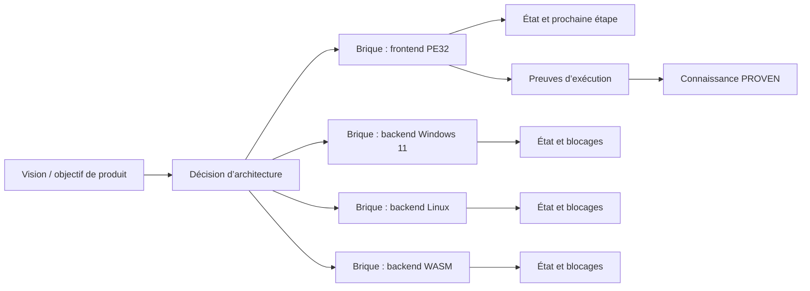

# Mémoire stratégique ARET-MMU : capacités, roadmap et évolutions

## Réponse courte

**Oui, ARET-MMU est conçu pour mémoriser ce type d’information.** Il ne le fait pas dans un unique fichier « TODO » ou dans le contexte fragile d’une conversation. Il répartit l’information selon sa nature :

| Ce que vous voulez retenir | Objet ARET-MMU adapté |
|---|---|
| Une capacité déjà disponible | `STATE` ou `MEASUREMENT` |
| Une règle d’architecture durable | `ARCHITECTURE` ou `RULE` |
| Une orientation choisie | `DECISION` |
| Une capacité à réaliser à moyen/long terme | `BRICK` + `DECISION` + `STATE` |
| Une possibilité encore à étudier | `HYPOTHESIS` ou `DISCOVERY` |
| Une tâche bloquée | `BRICK` + relation `BLOCKED_BY` + `STATE` |
| Une preuve qu’une capacité fonctionne | `PROOF` lié à une connaissance, puis `PROVEN` si admissible |

Le Front n’est pas la roadmap complète. Il ne contient que **ce qui est prioritaire maintenant**. La roadmap et les capacités restent dans les objets canoniques, puis le Front pointe vers les quelques objets utiles pour la session en cours.

## 1. La mémoire stratégique n’est pas une seule liste

Une roadmap sérieuse mélange plusieurs natures d’information. Dire « ARET devra transpiler des exécutables PE32 vers Windows 11, Linux et WASM » contient en réalité quatre choses différentes : une ambition produit, une décision d’architecture éventuelle, des briques de travail, et des preuves futures.

ARET-MMU évite de tout mettre dans une même note car une note unique ne dit pas ce qui est déjà fait, ce qui est prévu, ce qui est bloqué et ce qui a été vérifié. Le système utilise plutôt un **graphe de fiches**.



## 2. Ce qui est déjà géré par le MCP actuel

Le MCP dispose déjà de tous les types nécessaires à cette mémoire stratégique.

### Les capacités actuelles

Une capacité livrée se mémorise comme une fiche `STATE`, éventuellement complétée par une `MEASUREMENT` et une ou plusieurs preuves. Par exemple :

> « ARET peut analyser tel format, sur tel environnement, avec telles limites connues. »

Tant qu’il n’existe pas de gate réussi, le statut doit rester `OBSERVED` ou `ACTIVE`, selon le cas. Lorsque les oracles pertinents ont produit une preuve `PASS` admissible, la connaissance peut devenir `PROVEN`.

### Les objectifs futurs

Un objectif qui n’est pas encore réalisé se mémorise d’abord comme une `DECISION` ou une `HYPOTHESIS`, puis comme une ou plusieurs `BRICK` planifiées. Il n’est donc jamais confondu avec une capacité livrée.

Les briques du Store actuel illustrent ce principe : `AUTO-LIFT-02` et `M7-GUI` sont actives ; `FIBERS-01` à `FIBERS-05` et `PHASE-A` à `PHASE-C` sont planifiées. Une brique représente un chantier mesurable et possède un état `PLANNED`, `ACTIVE`, `BLOCKED`, `DONE` ou `OBSOLETE`.

### Les évolutions d’architecture

Une évolution telle que « ajouter un nouveau backend de transpilation » doit recevoir une fiche `ARCHITECTURE`. Elle explique le modèle choisi, les interfaces concernées, les compromis et les hypothèses. La décision de lancer effectivement le chantier reçoit une fiche `DECISION` reliée à cette architecture.

Les relations rendent le tout navigable :

| Relation | Usage dans une roadmap |
|---|---|
| `IMPLEMENTS` | Une brique met en œuvre une architecture ou une décision. |
| `APPLIES_TO` | Une règle s’applique à une plateforme ou un format. |
| `BLOCKED_BY` | Une brique est bloquée par une dépendance ou un risque. |
| `INFORMED_BY` | Une décision est éclairée par une analyse ou une mesure. |
| `VERIFIED_BY` | Une capacité est validée par une preuve. |
| `SUPERSEDES` | Une stratégie remplace une ancienne stratégie. |

## 3. Le cas concret : PE32 vers Windows 11, Linux et WASM

L’intention suivante ne devrait pas être stockée comme une seule phrase :

> « À terme, ARET devra pouvoir transpiler un EXE 32 bits vers Windows 11, Linux et WASM. »

Elle doit devenir un petit portefeuille d’objets cohérents.

| Niveau | Objet recommandé | Exemple de contenu | Statut initial |
|---|---|---|---|
| Vision | `DECISION` | « Étendre ARET au transpile multi-cible de PE32 x86. » | `HYPOTHESIS` ou `ACTIVE` selon décision prise |
| Architecture | `ARCHITECTURE` | Contrat IR, ABI cible, runtime, imports, exceptions, GUI. | `HYPOTHESIS` puis `ACTIVE` |
| Brique 1 | `BRICK` | `PE32-FRONTEND-01` : parsing et levée x86 PE32. | `PLANNED` |
| Brique 2 | `BRICK` | `TARGET-WIN11-01` : ABI Windows x64/ARM64 et runtime. | `PLANNED` |
| Brique 3 | `BRICK` | `TARGET-LINUX-01` : ELF, SysV ABI, libc/runtime. | `PLANNED` |
| Brique 4 | `BRICK` | `TARGET-WASM-01` : génération WASM/WASI et adaptateurs d’import. | `PLANNED` |
| Risque | `HYPOTHESIS` | Les exceptions SEH x86 peuvent empêcher une équivalence portable directe. | `HYPOTHESIS` |
| Décision de compromis | `DECISION` | Translation d’exceptions via runtime ARET plutôt que mapping natif direct. | `ACTIVE` après validation humaine |
| Preuve | `PROOF` + `MEASUREMENT` | Exécution d’un corpus PE32 sous les trois cibles avec résultat comparé. | `PASS`/`FAIL`/etc. |

Après cette structuration, une session peut demander : « quelles sont les briques bloquées de la stratégie multi-cible PE32 ? » sans relire toute l’histoire. Le MCP traverse les relations, lit les états et retourne seulement les objets concernés.

## 4. La convention recommandée

Le schéma V5 possède déjà les primitives nécessaires ; il ne force pas encore un vocabulaire détaillé de portfolio. Pour éviter que chaque agent stocke les objectifs différemment, il est recommandé d’adopter la convention suivante.

### 4.1 Machine à états d’un objectif stratégique

Une idée ne doit jamais passer directement de « souhaitée » à « disponible ». La chaîne standard est la suivante :

```text
DISCOVERY ou HYPOTHESIS
          ↓ arbitrage humain
DECISION
          ↓ spécification
ARCHITECTURE
          ↓ découpage mesurable
BRICK (PLANNED)
          ↓ démarrage du chantier
BRICK (ACTIVE)
          ↓ clôture et gate(s) réussi(s)
BRICK (DONE) + PROOF PASS admissible
          ↓
STATE (PROVEN) : capacité réellement démontrée
```

Chaque étape répond à une question différente. Une `HYPOTHESIS` exprime une possibilité, une `DECISION` confirme une intention, une `ARCHITECTURE` décrit la solution, une `BRICK` organise le travail, et un `STATE` `PROVEN` décrit uniquement une capacité effectivement démontrée.

### 4.2 Identifiants de brique

Utiliser des identifiants stables, explicites et préfixés :

| Préfixe | Usage | Exemple |
|---|---|---|
| `M<N>-` | Jalon d’intégration majeur. | `M7-GUI-COMCTL32`, `M8-SUBPROCESS` |
| `TARGET-` | Plateforme, backend ou cible d’exécution. | `TARGET-WASM-01`, `TARGET-WIN11-PE64` |
| `LIFT-`, `ABI-`, `EH-` | Chantier profond par sous-système ARET. | `LIFT-PE32-01`, `ABI-SYSV-01` |
| `INDUS-` | Industrialisation, automatisation, CI et outillage. | `INDUS-AUTO-LIFT-02` |
| `PHASE-` | Phase transverse, rarement utilisée pour un travail technique isolé. | `PHASE-B` |

Le numéro n’est pas une estimation de durée. Il est un identifiant stable : la brique peut être enrichie sans changer d’ID.

### 4.2 Tags de connaissance

Utiliser des tags courts et réguliers pour la découverte, par exemple :

```text
roadmap
capability
industrialization
pe32
x86
windows11
linux
wasm
backend
runtime
abi
exceptions
```

Les tags accélèrent `aret_find`. Ils ne remplacent ni les relations ni une décision d’architecture.

### 4.3 Structure minimale d’une fiche stratégique

Toute fiche de vision, décision ou architecture devrait répondre à ces questions :

| Champ logique | Question |
|---|---|
| Intention | Qu’est-ce que nous voulons rendre possible ? |
| Périmètre | Quels formats, plateformes, architectures et sous-systèmes sont concernés ? |
| État | Est-ce une hypothèse, une décision, un travail actif ou une capacité démontrée ? |
| Dépendances | Quelles briques, technologies ou règles doivent exister avant ? |
| Risques | Qu’est-ce qui pourrait invalider ou modifier la stratégie ? |
| Critère de réussite | Quelle preuve ou mesure permettra de dire que c’est fait ? |
| Prochaine action | Quelle est la prochaine brique mesurable, pas seulement le prochain souhait ? |

### 4.4 Utilisation du Front

Le Front ne doit jamais contenir toute la roadmap. Il doit contenir seulement :

1. la brique active ;
2. le mur ou le risque le plus important ;
3. la prochaine action mesurable ;
4. trois à cinq adresses des décisions, règles ou mesures utiles maintenant.

Quand l’équipe passe de `AUTO-LIFT-02` à la stratégie multi-cible, elle remplace le Front de manière auditée. Les objets d’architecture, les autres briques et les objectifs long terme restent dans SQLite : ils ne sont pas perdus quand ils ne sont plus dans le Front.

> **Règle d’or du Front :** le champ `brick` du Front ne doit référencer qu’une brique `ACTIVE`. Une brique `PLANNED` représente un futur possible ; la mettre dans le Front ferait croire à la session qu’elle est le chantier en cours. Les briques planifiées restent dans la base et sont retrouvées par recherche ou par `aret_get_roadmap`.

## 5. Ce qui est important à ne pas confondre

| Formulation | Objet correct | Ce qu’il ne faut pas faire |
|---|---|---|
| « Nous aimerions supporter WASM. » | `HYPOTHESIS` ou `DECISION`, puis brique planifiée. | Le déclarer comme capacité active ou prouvée. |
| « Le backend WASM est en cours. » | Brique `ACTIVE` + `STATE`. | Écraser l’objectif initial sans conserver la décision. |
| « Le backend WASM produit un module valide. » | `MEASUREMENT` / `OBSERVATION`. | Dire `PROVEN` sans preuve. |
| « Le corpus PE32 passe sur WASM avec équivalence. » | Preuve `PASS` + capacité `PROVEN`. | Mettre seulement une phrase dans le Front. |
| « La stratégie précédente n’est plus retenue. » | Nouvelle `DECISION` + `SUPERSEDES`. | Modifier le texte de l’ancienne décision. |

## 6. Roadmap V1.1 désormais disponible

Le MCP propose maintenant une vue métier de roadmap : les briques portent `milestone`, `target_platform` et `priority` de 1 à 5. `aret_get_roadmap` restitue de manière bornée les briques, leurs états, bloqueurs, relations d’implémentation et preuves directes. `aret_export_roadmap` génère un Markdown hashé à partir de SQLite, sans maintenir de fichier `ROADMAP.md` manuel divergent.

Les limites restantes sont volontaires. Les champs `responsable`, `date cible` et estimation de charge ne sont pas des colonnes canoniques en V1.1 : ils peuvent être décrits dans les décisions et briques lorsque nécessaire, sans simuler une planification précise. Si le portefeuille devient très grand, une future V1.2 pourra ajouter une vue de portefeuille ou une UI dérivée, sans revenir à une liste Markdown non versionnée.

## 7. Exemple de déroulement pour un nouvel objectif

Lorsqu’une idée apparaît — par exemple supporter un nouveau format de binaire — la séquence recommandée est :

1. Créer une `DISCOVERY` ou une `HYPOTHESIS` si l’idée n’est pas encore validée.
2. Créer une `ARCHITECTURE` qui décrit les impacts techniques connus.
3. Créer une `DECISION` lorsque vous choisissez de lancer ou de différer la stratégie.
4. Créer les `BRICK` planifiées, chacune avec un critère de réussite mesurable.
5. Ajouter les relations `IMPLEMENTS`, `BLOCKED_BY`, `INFORMED_BY` et `APPLIES_TO` nécessaires.
6. Lorsque le travail commence, passer la brique de `PLANNED` à `ACTIVE` et remplacer le Front.
7. Enregistrer les mesures et preuves à chaque jalon.
8. Promouvoir une capacité à `PROVEN` seulement lorsque les gates pertinents ont réussi.
9. Si une stratégie change, créer une nouvelle décision et la relier avec `SUPERSEDES`.

## Conclusion

ARET-MMU gère donc la mémoire du présent **et** du futur, mais avec une discipline :

- les capacités réelles sont des états et des preuves ;
- les objectifs sont des décisions et des briques ;
- les évolutions sont des architectures reliées ;
- les risques sont des hypothèses explicites ;
- le Front ne montre que la priorité actuelle ;
- le graphe conserve tout le reste, même lorsque Claude change de session.

C’est ce qui permet de se souvenir durablement non seulement de « ce qu’ARET fait aujourd’hui », mais aussi de « ce qu’ARET doit devenir, pourquoi, dans quel ordre, avec quels risques et par quelles preuves ».

## Références

[1]: ../../../upload/ARET-MMU_Architecture_Document_Definitif_v5_final.md "Architecture V5 : types, statuts, briques, relations et Active Front"
[2]: ../core/repository.py "Objets canoniques, mutations et relations"
[3]: ../aret_mmu_server.py "Façade MCP métier"
[4]: ../../../aret_runtime_snapshot_v5_final.json "État final des briques et du Front"
[5]: ../schema/005_roadmap_bricks.sql "Métadonnées roadmap V1.1"
[6]: ../migration/bootstrap_roadmap_v11.py "Classement idempotent V1.1"
