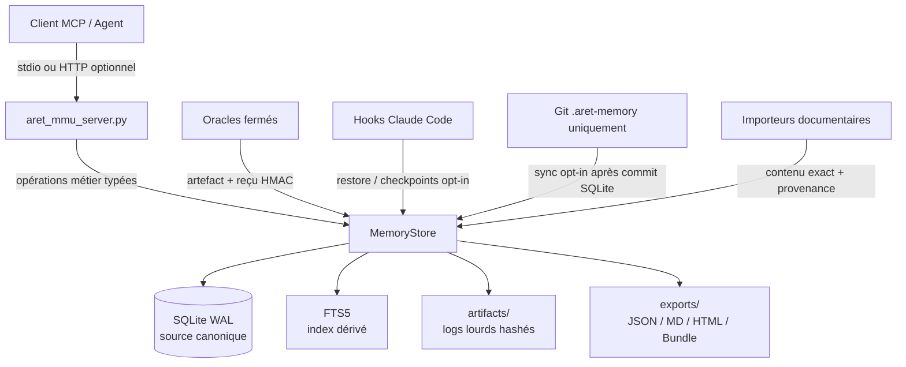
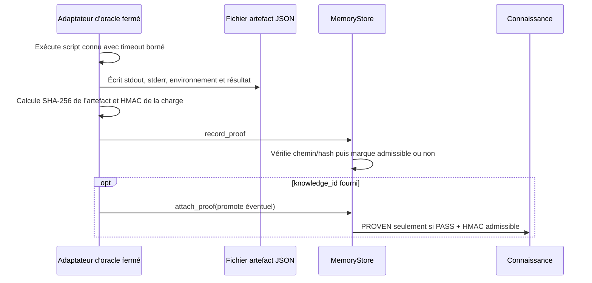

# Revue exhaustive du fonctionnement actuel du MCP ARET-MMU

**Objet :** dossier technique à soumettre à vérification.
**Périmètre vérifié :** révision source `232a6ebf1d27514a1f8a401966dbb3756ff51a8a`, complétée par les fichiers non encore suivis qui constituent la livraison ARET-MMU actuelle.
**Date de revue :** 19 août 2026.
**Méthode :** lecture du serveur MCP, du référentiel SQLite, du schéma et de ses migrations, des hooks, des adaptateurs d’oracle, du gestionnaire Git, des importeurs et des tests ; exécution de la suite de tests, du contrôle MCP stdio, de la compilation Python et d’un relevé en lecture seule du Memory Store.

> **Conclusion courte.** ARET-MMU est une mémoire technique locale, structurée et probatoire. Sa source de vérité est SQLite ; le serveur MCP ne fournit que des opérations métier déterministes. La découverte est séparée de la lecture exacte, les objets de connaissance sont append-first, le statut `PROVEN` est conditionné par une preuve `PASS` HMAC-admissible, les artefacts sont hashés hors base et tout changement métier laisse une trace d’audit. Les mécanismes annexes — hooks Claude Code, bundles vérifiés, importeurs documentaires et Git borné — respectent la même séparation entre état canonique, vues dérivées et actions explicitement contrôlées. [1] [2]

## 1. Résultat de la vérification

| Élément vérifié | Résultat observé | Statut |
|---|---:|---|
| Tests automatisés | 27 réussis | **Conforme** |
| Intégration MCP stdio | 28 outils déclarés ; `aret_boot` opérationnel | **Conforme** |
| Compilation statique Python | `compileall` sans erreur sur serveur, cœur, preuves, hooks, migrations et opérations | **Conforme** |
| Migrations SQLite appliquées | 3 migrations, checksums stockés | **Conforme** |
| Mémoire livrée | 514 connaissances sourcées, 1 071 événements d’audit | **Conforme** |
| Politique Git par défaut | `auto_commit=false`, `auto_push=false` | **Conforme** |
| Source historique 91 | Absente ; refus explicite du contrôleur, aucun contenu inventé | **Attente externe** |

Le répertoire de travail porte des modifications non enregistrées dans Git : `.claude/settings.json`, les trois lanceurs de hooks ARET-MMU et `aret-memory/`. Cette situation est cohérente avec une livraison prête à être validée ou committée ; elle signifie cependant que la livraison examinée ne se limite pas au commit Git historique `232a6ebf`. Aucun défaut d’espacement n’a été détecté par `git diff --check`.

## 2. Architecture exécutée



Le serveur est une façade mince. Il instancie un `MemoryStore`, déclare les outils avec le SDK MCP et convertit les erreurs métier en résultats structurés `{ok, operation, result|error}`. Il n’expose ni SQL libre, ni exécution de commande générique, ni recherche vectorielle. Le transport normal est stdio ; un transport HTTP diffusible est disponible seulement si le processus est lancé avec `--streamable-http`. [1]

Le `MemoryStore` porte la politique métier. Il crée la base, applique les migrations hashées, ouvre SQLite avec clés étrangères, journal WAL et délai d’attente de 5 secondes, puis centralise les écritures sous `BEGIN IMMEDIATE`. Une mutation est d’abord validée en SQLite ; une synchronisation Git éventuellement configurée s’exécute ensuite et ne peut jamais annuler cette transaction déjà committée. [2]

## 3. Source canonique et état effectivement livré

La source canonique est le fichier `.aret-memory/aret_memory.sqlite`. Les exports, l’index de recherche et le contexte injecté dans une session sont des vues dérivées et ne remplacent pas la base. La base inspectée contient les valeurs suivantes.

| Famille | Nombre observé | Commentaire |
|---|---:|---|
| Composants | 17 | Racines fonctionnelles des connaissances importées. |
| Fonctions adressables | 0 | Primitif disponible, aucun symbole enregistré dans le jeu livré. |
| Briques | 0 | Primitif disponible, aucune brique persistée dans le jeu livré. |
| Connaissances | 514 | Toutes avec provenance documentaire structurée. |
| Preuves | 0 | La chaîne probatoire est implémentée, mais aucune preuve d’exécution n’est livrée dans l’état actuel. |
| Relations | 0 | Le modèle et les outils existent ; les migrations documentaires n’en ont pas créé. |
| Événements d’audit | 1 071 | Créations, imports et opérations de lot audités. |
| Sources documentaires | 514 | Une source vérifiable par connaissance importée. |
| Lots de migration | 4 | Pilote, journal 71, références 70/80/81 et trackers 82/90. |

Les 514 connaissances se répartissent ainsi : 300 `FORENSIC`, 99 `MEASUREMENT`, 66 `OBSERVATION`, 20 `STATE`, 10 `ARCHITECTURE`, 8 `RULE`, 7 `DISCOVERY` et 4 `DECISION`. Les statuts livrés sont volontairement prudents : 478 `OBSERVED` et 36 `ACTIVE`; aucune connaissance n’est pré-promue `PROVEN`. Cette distribution est conforme à l’objectif de ne jamais convertir un texte historique en preuve d’exécution. [3]

## 4. Modèle de données, intégrité et immutabilité

### 4.1 Tables canoniques

| Table | Rôle opérationnel |
|---|---|
| `component` | Sous-système stable et adressable. |
| `function_symbol` | Fonction/symbole lié à un composant, identifié par composant, module et symbole. |
| `brick` | Unité de travail avec état `PLANNED`, `ACTIVE`, `BLOCKED`, `DONE` ou `OBSOLETE`. |
| `knowledge` | Page de mémoire canonique : type, statut, contenu, hash, liens optionnels et version. |
| `knowledge_tag` | Tags normalisés des connaissances. |
| `proof` | Exécution, résultat, environnement, artefact, hash et recevabilité d’une preuve. |
| `proof_link` | Lien explicite connaissance–preuve. |
| `relation` | Graphe typé entre entités existantes. |
| `front_state` | Pointeurs de contexte chaud, séparés des connaissances froides. |
| `audit_event` | Journal avant/après des opérations significatives. |
| `migration_batch` / `knowledge_source` | Provenance documentaire, hash d’extrait et suivi d’import. |
| `bundle_import` | Registre d’import de bundles pour idempotence. |
| `id_sequence` | Allocation déterministe des identifiants séquentiels. |

Les tables sont déclarées `STRICT`. Les clés étrangères sont activées pour chaque connexion. Le schéma contient des index sur les liaisons de connaissances, preuves et relations, et un index FTS5 séparé pour la découverte textuelle. [4]

### 4.2 Types, statuts et relations admis

| Élément | Valeurs reconnues |
|---|---|
| Types de connaissances | `RULE`, `ARCHITECTURE`, `DECISION`, `FORENSIC`, `OBSERVATION`, `HYPOTHESIS`, `STATE`, `MEASUREMENT`, `DISCOVERY` |
| Statuts | `ACTIVE`, `PROVEN`, `OBSERVED`, `HYPOTHESIS`, `SUPERSEDED`, `OBSOLETE`, `CONFLICTING` |
| Résultats de preuves | `PASS`, `FAIL`, `ERROR`, `SKIPPED`, `UNKNOWN` |
| Relations | `VERIFIED_BY`, `SUPERSEDES`, `INFORMED_BY`, `BLOCKED_BY`, `IMPLEMENTS`, `DERIVED_FROM`, `CONCERNS`, `APPLIES_TO`, `CAUSED_BY`, `EVOLVES_TO` |

Les identifiants de composant et de brique sont normalisés en majuscules et limités à 2–32 caractères alphanumériques avec `_` et `-`. Les tags sont normalisés en majuscules, dédoublonnés, limités à 64 caractères et validés par expression régulière. [2]

### 4.3 Invariants appliqués au niveau SQL

Le code Python n’est pas le seul rempart. Trois déclencheurs SQL rendent les invariants résistants à un appel contournant la façade métier :

1. une insertion de connaissance directement en `PROVEN` est refusée ;
2. toute promotion vers `PROVEN` sans une preuve liée, `PASS` et admissible est refusée ;
3. la réécriture des champs sémantiques d’une connaissance est refusée — la correction doit créer une nouvelle version.

Le serveur applique donc une stratégie *append-first*. Une connaissance qui remplace une autre est créée avec `supersedes_id`, reçoit une version incrémentée, crée la relation `SUPERSEDES` et rétrograde l’ancienne en `SUPERSEDED`. Le contenu, le titre, les liens métier et le hash de l’ancienne page ne sont jamais modifiés. [2] [4]

## 5. Adressage, découverte et lecture exacte

Les ressources canoniques lisibles sont adressées sous la forme `ARET://<type>/<identifiant>`. Les types reconnus par le parseur sont `knowledge`, `component`, `function`, `brick`, `proof` et le cas spécial `ARET://front/current`. Les identifiants sont URL-encodés de façon stable et aucun chemin contenant un `/` n’est accepté. [5]

| Étape | Outil | Garantie |
|---|---|---|
| Amorçage | `aret_boot` | Doctrine, chemins, versions, mode écriture, configuration HMAC, état sync et bornes. |
| Reprise de session | `aret_restore` | Doctrine, versions et Active Front, sans journal massif. |
| Découverte | `aret_find` | Métadonnées et score FTS éventuel, jamais le contenu intégral. |
| Recherche forensique | `aret_get_forensics` | Raccourci contraint à `FORENSIC` avec composant ou fonction obligatoire. |
| Lecture canonique | `aret_read` | Objet exact, contenu, hash, sources et liaisons. |
| Lecture multiple | `aret_read_batch` | Adresses explicites, sans doublon, bornes d’objets et d’octets. |
| Contexte chaud | `aret_get_front` | Front, métadonnées et adresses pertinentes. |

`aret_find` accepte des filtres déterministes sur composant, fonction, brique, type, statut, tag, texte et date. Sans critère, il renvoie volontairement une découverte vide. Avec texte, il construit une expression FTS5 paramétrée à partir des termes ; les résultats sont ordonnés par score BM25 mais la notice rappelle explicitement qu’un score n’est jamais une preuve. La lecture est une seconde action explicite. [2]

Les limites par défaut sont de 20 objets et 65 536 octets ; les limites dures sont respectivement 100 et 262 144 octets. Le serveur refuse un dépassement avant de livrer un lot partiel silencieux. [2] [6]

## 6. Outils MCP exposés : contrat actuel complet

La façade déclare **28 outils**. Les outils de mutation échouent lorsque `ARET_WRITE_ENABLED` est absent ou différent de `true`; ce mode lecture seule est le défaut de sécurité. [1] [2]

### 6.1 Lecture, contexte et navigation

| Outil | Effet | Points de contrôle |
|---|---|---|
| `aret_boot` | Lit le contrat et l’état du Store. | Aucun effet de bord. |
| `aret_get_front` | Lit l’Active Front. | Ignore les adresses Front invalides au lieu de les résoudre heuristiquement. |
| `aret_restore` | Produit le noyau de reprise. | N’inclut pas le journal complet. |
| `aret_find` | Découvre des candidats. | Limite, types/statuts validés, contenu absent du résultat. |
| `aret_read` | Lit une ressource adressée. | Adresse canonique obligatoire. |
| `aret_read_batch` | Lit plusieurs ressources connues. | Refuse zéro adresse, doublons et dépassements. |
| `aret_get_forensics` | Découvre les forensics ciblés. | Composant ou fonction obligatoire. |
| `aret_get_proofs` | Liste les preuves liées. | N’ouvre pas d’artefact lourd. |
| `aret_get_related` | Traverse le graphe explicite. | Direction `incoming`, `outgoing` ou `both`; type validé. |
| `aret_read_artifact` | Restitue un artefact textuel hashé. | Chemin borné, hash recontrôlé, taille maximale et indicateur de troncature. |

### 6.2 Écriture structurée et auditée

| Outil | Effet | Invariant clé |
|---|---|---|
| `aret_append_knowledge` | Crée une connaissance, tags, sources et liens de preuves. | `PROVEN` requiert au moins une preuve `PASS` admissible explicitement liée. |
| `aret_update_front` | Met à jour 1–20 clés du Front. | Clés et tailles validées ; événement avant/après. |
| `aret_rebuild_front` | Reconstitue certains pointeurs dérivés. | Ne supprime pas les clés de travail existantes. |
| `aret_record_proof` | Enregistre une preuve et sa recevabilité. | Reçu HMAC contrôlé ; une preuve invalide reste consultable mais non admissible. |
| `aret_attach_proof` | Lie une preuve existante. | La promotion est refusée si la preuve n’est pas `PASS` + admissible. |
| `aret_invalidate_proof` | Rend une preuve non admissible. | Rétrograde les `PROVEN` qui n’ont plus de `PASS` admissible. |
| `aret_add_relation` | Ajoute une relation typée. | Deux entités existantes, pas de relation réflexive. |
| `aret_supersede_relation` | Crée un remplacement de relation. | L’ancienne relation est conservée ; la chaîne est inscrite dans l’audit `SUPERSEDE_RELATION`. |
| `aret_register_component` | Crée un composant. | Identifiant stable et unicité. |
| `aret_register_function` | Crée un symbole. | Composant préalable et ID dérivé `COMP:module!symbol`. |
| `aret_register_brick` | Crée une brique. | État et composant contrôlés. |
| `aret_rebuild_index` | Reconstruit FTS5. | Cache dérivé uniquement, journalisé. |

### 6.3 Exécution contrôlée, synchronisation et portabilité

| Outil | Effet | Contrôle principal |
|---|---|---|
| `aret_run_oracle` | Exécute un oracle de liste fermée puis crée artefact et preuve. | Nom d’oracle, fixture, délai, dépendances et script contraints. |
| `aret_sync_memory` | Lance l’auto-sync de la mémoire courante. | La politique locale contrôle l’effet ; périmètre `.aret-memory/` exclusif. |
| `aret_export_reference_91` | Reconstruit la vue 91. | Dérivée de `STATE`, `RULE`, `MEASUREMENT`, `DECISION` et `BRICK`. |
| `aret_export` | Produit JSON, Markdown, HTML ou bundle. | Vue dérivée seulement ; HTML échappé. |
| `aret_export_bundle` | Produit un bundle ZIP v3. | Manifest hashé, snapshot hashé, migrations et artefacts inventoriés. |
| `aret_import_bundle` | Importe un bundle vérifié. | Cible vide seulement, idempotence, absence de fusion implicite. |

## 7. Chaîne probatoire et Evidence Store

Une preuve est un fait d’exécution, distinct d’une connaissance. Elle enregistre notamment le type d’oracle, la commande, le résultat, le code de sortie, l’environnement sérialisé, les dates, l’artefact et son hash, un hash de charge utile, un HMAC et le booléen `admissible`. Le HMAC porte une enveloppe JSON canonique triée comprenant les champs sémantiquement critiques. [2] [7]



La recevabilité est binaire. Sans `ARET_PROOF_HMAC_SECRET`, sans reçu ou avec un reçu différent de la valeur attendue, la preuve est conservée mais `admissible=0`. Cela permet d’auditer une exécution non fiable sans la transformer en justification de `PROVEN`. Lorsqu’une preuve est invalidée, le Store examine toutes les connaissances liées : chaque `PROVEN` sans autre preuve `PASS` admissible devient `OBSERVED`, avec un événement d’audit dédié. [2] [4] [6]

Les artefacts ne sont pas stockés dans SQLite. Ils sont placés sous `.aret-memory/artifacts/`, référencés par chemin relatif, puis relus avec contrôle SHA-256 avant toute restitution. Toute tentative de sortie du répertoire, tout fichier absent et tout hash modifié est refusé. [2] [6]

## 8. Oracles intégrés

| Nom MCP | Script fermé | Dépendances principales | Timeout maximal | Normalisation |
|---|---|---|---:|---|
| `difftest` | `bench/difftest.sh` | `bash`, `gcc`, binaire ARET | 1 800 s | `PASS` uniquement si équivalence totale explicitement rapportée. |
| `winediff` | `bench/winediff.sh` | `bash`, `wine`, MinGW, binaire ARET | 3 600 s | `PASS` uniquement si équivalence Wine totale rapportée. |
| `winehash` | `bench/winoracle/wine_hashes.sh` | `bash`, `wine`, MinGW | 3 600 s | `UNKNOWN` : mesure Wine à comparer, jamais faux gate `PASS`. |
| `funcdiff` | `bench/funcdiff.sh` | `bash`, `cargo` | 1 800 s | `PASS` seulement si le gate textuel l’annonce. |

Le client ne transmet ni commande shell brute ni chemin de script arbitraire. Le nom d’oracle est choisi dans un dictionnaire fermé. Une fixture, si autorisée, est limitée à `[A-Za-z0-9_.-]`; le délai ne peut pas dépasser le plafond de l’oracle. Les dépendances manquantes créent une preuve `SKIPPED`, pas un `FAIL` artificiel ni un `PASS`. Les tests couvrent le flux `PASS` avec promotion, le flux `FAIL`, les dépendances absentes et l’interdiction de promotion avec une preuve non admissible. [8] [9]

## 9. Active Front, reprise et hooks Claude Code

L’Active Front est une table de paires clé/valeur horodatées qui fournit un contexte court de travail. `aret_update_front` accepte au plus 20 clés ; les clés sont normalisées et les valeurs limitées à 4 Kio. `aret_rebuild_front` dérive des pointeurs vers les connaissances actives ou prouvées les plus récentes sans effacer le contenu métier déjà présent dans le Front. [2]

Les hooks sont installés dans `.claude/settings.json` pour `SessionStart`, `PreCompact` et `PostCompact`. Les trois lanceurs sont exécutables (`755`) et fixent explicitement `ARET_MEMORY_DIR` vers `aret-memory/.aret-memory`. [10] [11]

| Hook | Lecture / écriture | Réponse |
|---|---|---|
| `SessionStart` | Lecture seule | Exécute `restore()`, puis émet l’enveloppe officielle `hookSpecificOutput.additionalContext` avec doctrine, Front et jusqu’à 12 adresses pertinentes. |
| `PreCompact` | Lecture ; checkpoint seulement si `ARET_HOOK_WRITE_ENABLED=true` | Renvoie Front, audit récent borné à 1–100 et adresses à relire après reprise. |
| `PostCompact` | Lecture ; checkpoint seulement si activé | Renvoie doctrine, Front et adresses pertinentes ; le résumé de compaction est tracé comme audit, pas transformé en connaissance. |

Le contexte injecté est limité à 9 500 caractères. Les hooks impriment une unique enveloppe JSON sur stdout ; les erreurs métier sont également structurées. Le modèle ne reçoit donc pas un journal complet ni une mémoire sémantique non traçable. [12] [13]

## 10. Git : confinement et synchronisation

La couche `ops/git_memory.py` ne manipule que le dossier `.aret-memory/` déclaré dans un dépôt Git. Elle distingue :

- `status` : inventorie les changements mémoire et ceux hors mémoire ;
- `commit` : exige un message et une confirmation explicite dans son interface directe ;
- `push` : exige également une confirmation et refuse toute mémoire non committée ;
- `automatic_sync` : exécute un commit post-mutation uniquement si une politique locale active `auto_commit`.

Avant tout commit, la couche examine le statut Git complet et refuse si un fichier modifié est hors du sous-arbre mémoire autorisé. Le mécanisme automatique est appelé après le commit SQLite réussi. Une erreur Git est mémorisée dans `last_sync_status` mais ne produit pas de rollback SQLite. La politique livrée est sûre par défaut : `auto_commit=false`, `auto_push=false`, `remote=origin`, `branch` vide. [2] [14] [15]

> **Implication opérationnelle.** Le MCP ne peut pas committer le code source ARET via ce mécanisme. Même avec l’auto-commit activé, un changement hors `.aret-memory/` empêche le commit mémoire.

## 11. Migrations documentaires et provenance

Quatre importeurs ont été revus. Tous extraient le texte source exact, calculent le SHA-256 de l’extrait, créent un `knowledge_source` avec dépôt, révision, chemin, lignes et section, puis lient la connaissance à un `migration_batch` auditée. Les importeurs n’attribuent pas `PROVEN` aux textes historiques. [16] [17] [18] [19]

| Importeur | Sources | Méthode | État observé |
|---|---|---|---|
| `import_pilot.py` | Extraits définis de 70, 71, 80, 81 | Tranches de lignes fixes | 9 extraits déjà présents. |
| `import_journal_71.py` | Section chronologique du journal 71 | Blocs sous titres datés `### YYYY-MM-DD — …` ; classification fondée sur le titre | 378 entrées parsées et présentes. |
| `import_references_70_80_81.py` | Références 70, 80, 81 | Sections Markdown niveau 2/3, soustraction des plages déjà migrées | 55 objets doc 70, 10 doc 80, 21 doc 81 dans le Front. |
| `import_trackers_82_90.py` | Tracker 82 et corpus 90 | Sections Markdown niveau 2/3 | 33 objets doc 82 et 17 doc 90 dans le Front. |

Les exécutions répétées sont idempotentes : la provenance déjà présente est détectée par révision, chemin, lignes et hash de source. Lorsque le contenu ou le manifest d’un même lot varie dans les cas stricts, l’importeur exige un nouveau lot explicite plutôt que de réécrire l’historique. L’index FTS est reconstruit une fois après les imports en masse. [16] [17] [18] [19]

### Statut définitif du document 91

Le document 91 était une synthèse redondante produite par une autre IA à partir des documents 70, 71, 80, 81, 82, 83 et des informations importantes déjà migrées. Il ne constitue donc ni une source historique à attendre ni une provenance utile à importer. Le contrôleur `migration/import_doc91.py` retourne désormais le statut `NOT_APPLICABLE` et n’exécute aucune migration. [20]

`aret_export_reference_91` demeure une **vue dérivée de compatibilité** à partir des objets canoniques `STATE`, `RULE`, `MEASUREMENT`, `DECISION` et `BRICK`, avec un hash logique. Elle permet de produire une synthèse à la demande sans créer de seconde source de vérité. Le statut complet est documenté dans `STATUT_DOCUMENT_91.md`. [2] [20]

## 12. Exports et Memory Bundle v3

### 12.1 Exports de revue

`aret_export` construit un snapshot logique ordonné de toutes les tables canoniques utiles. Il produit :

| Format | Contenu | Contrôle |
|---|---|---|
| JSON | `db_hash` et snapshot complet. | Hash logique calculé sur JSON canonique. |
| Markdown | Front et connaissances lisibles. | Vue dérivée, SQLite reste canonique. |
| HTML | Front et connaissances sous forme autonome. | Toutes les chaînes injectées sont échappées HTML. |
| Bundle | Délègue au bundle portable v3. | Voir ci-dessous. |

Le test de conformité vérifie qu’un titre et un contenu contenant du pseudo-HTML sont encodés et ne deviennent pas exécutables dans l’export. [2] [6]

### 12.2 Bundle

Un bundle ZIP v3 contient `manifest.json`, `snapshot.json`, les artefacts et une copie des migrations SQL. Le manifest porte les versions, l’identité de source optionnelle, le hash logique de snapshot, son SHA-256, l’inventaire hashé des artefacts et les hashes des migrations. Son propre hash est calculé sur le manifest hors champ de hash. [2]

À l’import, le Store refuse un ZIP incomplet ou dangereux, un manifest altéré, un snapshot altéré, une migration absente/modifiée, un artefact de taille ou hash incohérent, une collision d’artefact et une cible non vide. Le transfert vers une cible vide est idempotent grâce à `bundle_import`. Aucune fusion de deux SQLite vivantes n’est tentée. [2] [21]

## 13. Audit, opérations et contrôlabilité

Toute création de composant, fonction, brique, connaissance, preuve, relation, lien de preuve, mise à jour du Front, indexation, import de lot, import de bundle et checkpoint passe par `_audit`. L’événement conserve l’acteur, l’opération, l’entité, la date et, quand nécessaire, un avant/après JSON canonique. [2]

Les opérations de lecture ne modifient pas la base. Les écritures sont centralisées dans des transactions SQLite. Les sorties lourdes sont séparées en fichiers ; elles ne sont lues que sur demande. Les commandes externes sont limitées aux scripts d’oracle enregistrés. La surface MCP ne contient pas de primitive SQL libre ni de suppression générale. [1] [2] [8]

## 14. Couverture de tests réellement exécutée

La suite exécutée contient 27 tests. Elle couvre notamment les scénarios suivants.

| Domaine | Scénarios vérifiés |
|---|---|
| Mode lecture seule | Mutation refusée sans activation explicite. |
| Preuves | `PROVEN` refusé sans PASS HMAC-admissible ; promotion autorisée avec preuve signée. |
| Recherche | FIND sans contenu, puis lecture exacte ; bornes READ_BATCH. |
| Versionnement | Supersession de connaissance, audit et FTS reconstruisible. |
| Artefacts | Hash, lecture bornée et détection de falsification. |
| Invalidation | Démotion d’une connaissance devenue injustifiée. |
| HTML | Échappement de contenu dérivé. |
| Bundle v3 | Migrations hashées, round-trip, idempotence, cible non vide et altération. |
| Hooks | Contexte structuré en lecture seule et enveloppe SessionStart. |
| Git | Commit limité à la mémoire, refus hors périmètre et auto-sync opt-in. |
| Oracles | PASS, FAIL, SKIPPED, preuve non admissible et promotion. |
| Référence 91 | Synthèse dérivée depuis le canonique ; import non applicable. |
| Relations | Supersession append-only et événement `SUPERSEDE_RELATION`. |

Le contrôle d’intégration MCP démarre un client stdio, vérifie la déclaration des 28 outils et appelle `aret_boot` avec succès. La compilation de tous les modules Python a également réussi. [6] [9] [15] [21] [22]

## 15. Constats de vérification, limites et documentation à mettre à jour

| Priorité | Constat | Conséquence | Recommandation de vérification ou de suivi |
|---|---|---|---|
| Haute — externe | Le Markdown historique 91 est absent. | La provenance documentaire 91 n’est pas encore enregistrée. | Ajouter la source, exécuter son contrôleur, comparer à la vue 91, puis implémenter/valider l’enregistrement de provenance final. |
| Moyenne | `CONTRAT_MCP_V1.md` est un document historique : il ne liste pas les 28 outils et dit que l’auto-sync Git et les hooks sont hors périmètre. | Un vérificateur lisant seulement ce document verrait une description incomplète. | Mettre à jour ce contrat ou le marquer explicitement « V1 historique », puis référencer ce dossier comme état courant. |
| Moyenne | `ADAPTATEURS_ORACLES.md` ne mentionne pas `winehash`. | Documentation d’usage incomplète pour une capacité livrée. | Ajouter l’oracle `winehash` et son résultat volontairement `UNKNOWN`. |
| Moyenne | `CONTRATS_OPERATIONNELS.md` contient encore des mentions antérieures de bundle v2 et de Git seulement manuel. | Risque de confusion sur bundle v3 et auto-sync opt-in. | Actualiser ce document d’exploitation. |
| Basse — API | `aret_add_relation` et `aret_supersede_relation` retournent des chaînes `ARET://relation/<id>`, mais `relation` n’est pas un type lisible par `aret_read`. | Le lien est une référence utile, mais non résoluble par la primitive READ actuelle. | Soit documenter qu’il s’agit d’un identifiant de relation non lisible directement, soit ajouter une ressource `relation` adressable en version ultérieure. |
| Basse — modèle | La supersession de relation est consignée par audit, non par une colonne `superseded_by` dans `relation`. | Chaîne de remplacement consultable via audit, pas via une traversal de relation standard. | Suffisant pour l’append-only actuel ; ajouter un index/une vue dédiée si la navigation de chaînes devient un besoin. |
| Conditionnel | Oracles Wine/Windows et certains corpus dépendent des outils de l’environnement. | L’absence de dépendance produit `SKIPPED`, pas un verdict probatoire. | Exécuter les oracles dans l’environnement CI requis pour produire des preuves réelles. |

Ces constats ne remettent pas en cause les invariants essentiels observés. Ils séparent les limitations externes assumées, les améliorations de documentation et deux raffinements ergonomiques de l’API.

## 16. Procédure de vérification indépendante recommandée

Le vérificateur peut répéter les contrôles suivants depuis `aret-memory/` :

```bash
pytest -q
python3 tests/mcp_integration_check.py
python3 -m compileall -q aret_mmu_server.py core evidence hooks migration ops
python3 migration/import_doc91.py --json  # retourne NOT_APPLICABLE
```

Pour vérifier la politique Git sans modifier le code source, il peut contrôler le fichier `.aret-memory/sync_policy.json`, puis utiliser un dépôt de test avec un changement sous `.aret-memory/` et, séparément, un fichier hors périmètre. Les tests `tests/test_git_autosync.py` et `tests/test_operational_extensions.py` constituent les scénarios de référence.

Pour vérifier la chaîne probatoire, le contrôleur doit fournir un secret `ARET_PROOF_HMAC_SECRET`, exécuter un adaptateur d’oracle dans un environnement où ses dépendances sont disponibles, puis contrôler à la fois le lien `proof_link`, le champ `admissible`, le statut de connaissance et le hash de l’artefact.

## 17. Verdict final

Le MCP ARET-MMU actuel est **fonctionnel, déterministe, auditable et cohérent avec une mémoire technique locale à forte exigence de traçabilité**. Les composants effectivement livrés couvrent le stockage canonique, l’adressage, la séparation FIND/READ, les écritures append-first, les preuves HMAC, les artefacts hashés, les oracles fermés, les imports documentaires sourcés, les bundles vérifiés, les hooks de reprise et le Git mémoire borné.

Les éléments non finalisables sans apport externe sont explicitement refusés plutôt que simulés : en particulier, la provenance du document historique 91 attend sa source. Les écarts constatés sont principalement documentaires ou ergonomiques et sont listés de manière actionnable ci-dessus.

## Références

[1]: ../aret_mmu_server.py "Façade MCP actuelle : 28 outils et transports"
[2]: ../core/repository.py "MemoryStore : règles métier, transactions, preuves, export et import"
[3]: ../../../aret_runtime_snapshot.json "Relevé lecture seule de l’état observé de la base livrée"
[4]: ../schema/001_initial.sql "Schéma SQLite, contraintes, index et triggers"
[5]: ../core/addressing.py "Adressage ARET canonique"
[6]: ../tests/test_repository.py "Tests fondamentaux du Memory Store"
[7]: ../evidence/capture.py "Charge canonique et reçu HMAC des preuves"
[8]: ../evidence/adapters/oracles.py "Adaptateurs d’oracles à liste fermée"
[9]: ../tests/test_oracle_adapters.py "Tests de la chaîne d’oracle et de preuve"
[10]: ../../.claude/settings.json "Installation des hooks Claude Code"
[11]: ../../.claude/hooks/aret-mmu-session-start.sh "Lanceur SessionStart installé"
[12]: ../hooks/common.py "Transport JSON, contexte additionnel et garde d’écriture"
[13]: ../hooks/session_start.py "Hook SessionStart"
[14]: ../ops/git_memory.py "Git borné et auto-sync piloté par politique"
[15]: ../tests/test_git_autosync.py "Tests de commit automatique borné"
[16]: ../migration/import_pilot.py "Migration pilote et provenance exacte"
[17]: ../migration/import_journal_71.py "Import exhaustif déterministe du journal 71"
[18]: ../migration/import_references_70_80_81.py "Import non chevauchant des références"
[19]: ../migration/import_trackers_82_90.py "Import des trackers 82 et 90"
[20]: ../migration/import_doc91.py "Statut non applicable de la synthèse 91"
[21]: ../tests/test_operational_extensions.py "Tests d’intégration hooks, Git et bundles"
[22]: ../tests/test_architecture_conformance.py "Tests de conformité transversale"
[23]: ./CONTRAT_MCP_V1.md "Contrat V1 historique"
